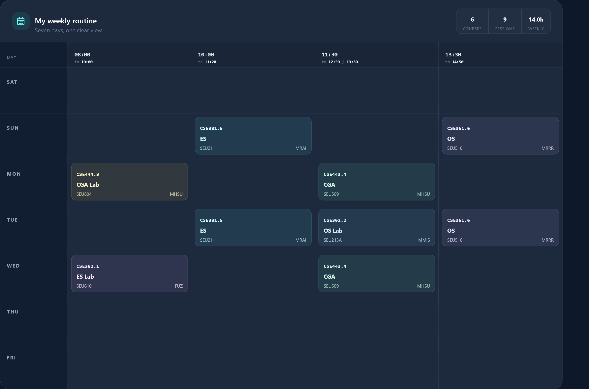

<div align="center">
  

  # SEU Routine Maker

  **A fast, private, and mobile-friendly weekly routine builder for Southeast University students.**

  Import a saved UMS page or scan a course screenshot, select your sections, and instantly create a clean seven-day class routine.

  
  
  
  
</div>

## Table of contents

- [About](#about)
- [Generated routine preview](#generated-routine-preview)
- [Features](#features)
- [How to use the web app](#how-to-use-the-web-app)
- [Course selection rules](#course-selection-rules)
- [Data storage, privacy, and security](#data-storage-privacy-and-security)
- [Run locally](#run-locally)
- [Available commands](#available-commands)
- [Project structure](#project-structure)
- [Troubleshooting](#troubleshooting)
- [Technology](#technology)
- [Developer](#developer)

## About

SEU Routine Maker converts course information from the Southeast University UMS into a readable weekly routine. It parses course codes, titles, faculty initials, class days, start and end times, and rooms directly in the browser.

No account, backend, or external database is required. The app is designed for both desktop and mobile devices and uses a dark theme inspired by the SEU UMS.

## Generated routine preview

<div align="center">
  
  <br />
  <sub>Example of a conflict-free seven-day routine generated from selected SEU course sections.</sub>
</div>

## Features

- Upload a saved UMS `.html`, `.htm`, `.mhtml`, or `.mht` page.
- Paste raw UMS HTML manually.
- Parse UMS Offered Sections and timetable information.
- Store parsed data in browser `localStorage`.
- Type multiple section codes using commas, spaces, or new lines.
- Search saved sections by code or course title.
- Filter organizer sections by exact time slot and single or combined meeting days.
- Upload PNG, JPG, or WebP screenshots and detect course codes with browser-based OCR.
- Generate the routine automatically—there is no Generate button.
- Display all seven days: SAT, SUN, MON, TUE, WED, THU, and FRI.
- Group classes with the same start time into one routine column.
- Detect exact and partial timetable conflicts as codes are entered.
- Prevent selecting more than one section of the same course.
- Edit automatically generated short course names.
- Print the routine or export it as PNG or PDF.
- Restore the previous routine after reopening the browser.
- Clear only the routine or reset all saved data.
- Responsive layout with a horizontally scrollable routine table on small screens.

## How to use the web app

### Method 1: Before or during course advising

Use this method with the UMS **Offered Sections** page.

1. Sign in to the Southeast University UMS.
2. Open **Advising Table**.
3. Set **View Sections By** to **Preregistered**.
4. Wait until the full Offered Sections list is visible.
5. Save the page as HTML:
   - **Desktop:** press `Ctrl + S`, select **Webpage, Complete** or **HTML**, and save the file.
   - **Mobile:** open the browser menu `⋮` and choose **Download**. Mobile Chrome may save the page as `.mhtml` or `.mht`; both formats are supported.
6. Open SEU Routine Maker.
7. Under **Add your UMS export**, upload the saved `.html`, `.htm`, `.mhtml`, or `.mht` file.
8. Wait for the success message confirming that the course sections were parsed and saved automatically.
9. Add section codes using either option:
   - Type or paste codes such as `CSE361.3`, one per line or separated by commas.
   - Use **Search saved sections** and select a result.
   - Open **Magic Organizer** to browse and filter all parsed sections visually.
10. The weekly routine updates automatically.

### Using the Magic Organizer filters

The organizer filters can be combined to narrow the section list:

1. Use **Filter by course** and **Filter by teacher** to limit the available sections.
2. Use **Time Slot** to select an exact class range, such as `08:30 - 09:50`.
3. Use **Day of Week** to select an exact single-day or combined-day schedule, such as **Sunday - Tuesday**.
4. Use the violet arrow button to collapse or expand the filter controls.
5. Select **Clear** to reset the search field and every active filter at once.

### Method 2: After successfully completing course advising

Use this method to rebuild a routine from the courses visible on the Student Dashboard.

1. Sign in to UMS and open **Student Dashboard**.
2. Select the **Registered Courses** tab.
3. Save the Registered Courses page as an HTML file.
4. Upload that HTML file under **Add your UMS export**.
5. Wait for the success message confirming that the HTML was parsed automatically before using image recognition.
6. Take a clear screenshot of the Registered Courses table. Make sure the course codes and section numbers are readable.
7. Under **Pick codes from an image**, select **Upload image**.
8. Wait for OCR to finish. Detected codes are added automatically, and the routine updates immediately.

> [!IMPORTANT]
> Image recognition selects codes from the course data already parsed from HTML. Always upload the relevant UMS HTML file and wait for the parsing success message before uploading a screenshot.

### Supported code formats

The image scanner can recognize complete codes and tables where the course and section are shown separately:

```text
CSE361.3

CSE361: Operating Systems     Sec 3
```

Both examples are interpreted as `CSE361.3`.

### Editing short course names

After selecting courses, use the **Course labels** section to edit the name displayed inside routine cards. Changes are saved automatically.

Examples:

| Full title | Default short name |
|---|---|
| Operating Systems | OS |
| Operating Systems Lab | OS Lab |
| Introduction to Embedded Systems | ES |
| Introduction to Embedded Systems Lab | ES Lab |
| Computer Graphics & Animation | CGA |
| Computer Graphics & Animation Lab | CGA Lab |

### Printing and exporting

When the routine has no unresolved conflicts or duplicate-course selections, use:

- **Print** to open the browser print dialog.
- **PNG** to download the routine as an image.
- **PDF** to download a landscape PDF.

## Course selection rules

### One section per course

Only one section of a course can be active. For example, `CSE362.3` and `CSE362.4` cannot both enter the final routine. If multiple sections are typed manually, the app displays **Keep** buttons so the user can choose one.

Selecting another section through autocomplete replaces the previous section of that course.

### Conflict detection

A conflict exists when two different courses overlap on the same day.

```text
Course A: SUN 13:30–15:30
Course B: SUN 15:00–16:20
Conflict: SUN 15:00–15:30
```

Classes at the same time on different days are not conflicts. Back-to-back classes are also allowed—for example, a class ending at `15:00` and another beginning at `15:00`.

When a conflict is found:

- The conflicting routine cards turn red.
- A live alert lists both codes, the day, and the overlapping time.
- Quick **Remove** buttons appear for the conflicting codes.
- Print, PNG, and PDF actions remain disabled until the conflict is resolved.

## Data storage, privacy, and security

### Is any data stored permanently?

**No data is stored in a permanent cloud database or on an application server.** SEU Routine Maker has no backend, user account system, or database. Routine processing happens inside the user's browser.

The app does use browser `localStorage`, so some data remains available on the same browser after closing or reopening the website. It stays there until the user selects **Reset saved data**, clears the browser's site data, or removes the browser profile.

| Data | Storage location | Retention |
|---|---|---|
| Imported raw UMS HTML | Browser `localStorage` | Until **Clear HTML**, **Reset saved data**, or browser site data is cleared |
| Parsed course sections | Browser `localStorage` | Until **Clear HTML**, **Reset saved data**, or browser site data is cleared |
| Selected course codes | Browser `localStorage` | Until **Clear routine**, **Clear HTML**, **Reset saved data**, or browser site data is cleared |
| Custom short names | Browser `localStorage` | Until **Clear HTML**, **Reset saved data**, or browser site data is cleared |
| Uploaded screenshots | Browser memory only | Cleared after reset, reload, or leaving the page |
| OCR language model | Browser cache/IndexedDB | Managed by the browser and removable through site-data settings |

### Private by design

- No UMS HTML, routine, course selection, or screenshot is uploaded to an application server.
- No UMS password or login credential is requested or collected.
- Uploaded screenshots are processed locally in the browser with Tesseract.js.
- The saved UMS HTML is parsed locally and is never rendered as executable page content.
- **Clear HTML** removes imported HTML, parsed sections, selected codes, custom labels, routine data, and image-scanner state.
- **Clear routine** removes selected courses and resets the image scanner while keeping parsed UMS data.
- **Reset saved data** removes imported HTML, parsed courses, selections, custom labels, and image-scanner state from the app.

> [!IMPORTANT]
> Browser `localStorage` is not encrypted. Anyone with access to the same unlocked browser profile may be able to inspect locally saved data. On a shared or public device, use **Reset saved data** when finished and clear the browser's site data for additional privacy.

The app is therefore private and secure from server-side data collection by design, while local-device security still depends on the user's browser profile and device access.

## Run locally

### Requirements

- [Node.js](https://nodejs.org/) 18 or newer
- npm
- A modern browser such as Chrome, Edge, Firefox, or Brave

### Installation

```bash
git clone https://github.com/fardinhossain/Seu-Routine_Maker.git
cd Seu-Routine_Maker
npm install
npm run dev
```

Open the local URL printed by Vite, usually:

```text
http://localhost:5173
```

> [!NOTE]
> Do not open `index.html` directly. React JSX must be compiled and served through Vite.

### Production build

```bash
npm run build
npm run preview
```

The optimized production files are created in `dist/`.

## Available commands

| Command | Purpose |
|---|---|
| `npm run dev` | Start the Vite development server. |
| `npm run build` | Create an optimized production build. |
| `npm run preview` | Preview the production build locally. |
| `npm test` | Run parser, OCR-code matching, conflict, and duplicate-section checks. |

## Project structure

```text
Seu-Routine_Maker/
├── public/
│   └── favicon.svg
├── scripts/
│   └── test-parser.mjs
├── src/
│   ├── components/
│   │   ├── AppHeader.jsx
│   │   ├── ConflictAlert.jsx
│   │   ├── CoursePicker.jsx
│   │   ├── ImageCourseScanner.jsx
│   │   ├── ImportPanel.jsx
│   │   ├── RoutineTable.jsx
│   │   └── ShortNameEditor.jsx
│   ├── lib/
│   │   ├── ocr.js
│   │   ├── parser.js
│   │   ├── routine.js
│   │   └── storage.js
│   ├── App.jsx
│   ├── index.css
│   └── main.jsx
├── index.html
├── package.json
├── tailwind.config.cjs
└── vite.config.js
```

## Troubleshooting

### The page is completely white

Run `npm run dev` and open the URL shown in the terminal. Do not double-click `index.html`.

### No course sections were found

- Confirm that the saved file is a UMS page containing course schedules.
- Make sure the page finished loading before saving it.
- Select **Preregistered** before saving the Offered Sections page.
- Try saving as **Webpage, Complete** on desktop.
- On mobile, upload the downloaded `.mhtml` or `.mht` file directly; renaming it to `.html` is not required.

### The image scanner is disabled

Upload and parse a UMS HTML file first. OCR only selects codes that exist in the saved course data.

### OCR did not find a code

- Use a clear, high-resolution screenshot.
- Crop unnecessary areas from the image.
- Keep course codes and section numbers visible.
- Avoid covering text with a cursor, selection handle, or popup.
- Supported uploads are PNG, JPG, and WebP up to 12 MB.

### A course is missing from the routine

Check the warning under the section-code input. The code may not exist in the parsed HTML, or another section of the same course may already be active.

### The favicon or latest design is not visible

Hard-refresh the browser using `Ctrl + F5`.

## Technology

- **React** for the user interface
- **Vite** for development and production builds
- **Tailwind CSS** for responsive styling
- **Tesseract.js** for client-side OCR
- **html2canvas** for PNG capture
- **jsPDF** for PDF export
- **Lucide React** for icons
- **localStorage** for browser persistence

## Developer

Made by an SEU student.

Developed by [@Fardin_Hossain](https://mdfardin.vercel.app/).
